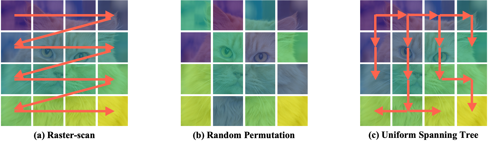

# ⭐ Spanning Tree Autoregressive Visual Generation
> [**Spanning Tree Autoregressive Visual Generation**](https://arxiv.org/abs/2511.17089),            
Sangkyu Lee1,2*,
Changho Lee3,
Janghoon Han3,
Hosung Song3, 
Tackgeun You2, 
Hwasup Lim2, 
Stanley Jungkyu Choi3, 
Honglak Lee3,4,
Youngjae Yu5 
1Yonsei University,
2KIST,
3LG AI Researchr, 
4University of Michigan, Ann Arbor,
5Seoul National University 
\*Work mainly done during internship at LG AI Research.

  

This is the official repository of **"Spanning Tree Autoregressive Visual Generation"**.

## Usage

**The code will be updated soon!**